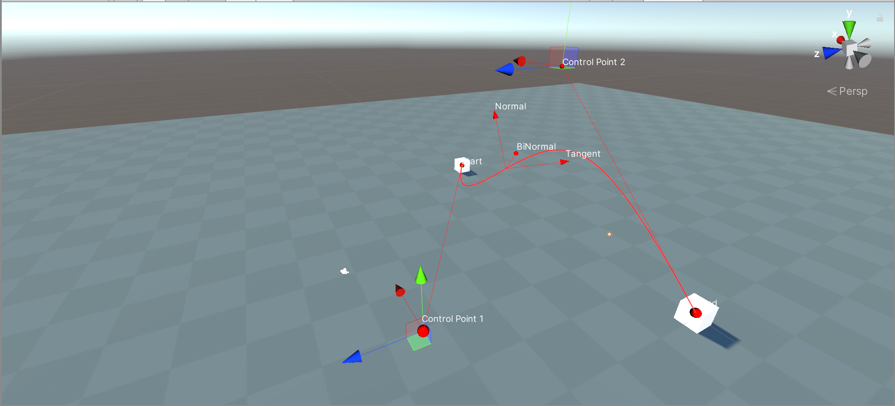
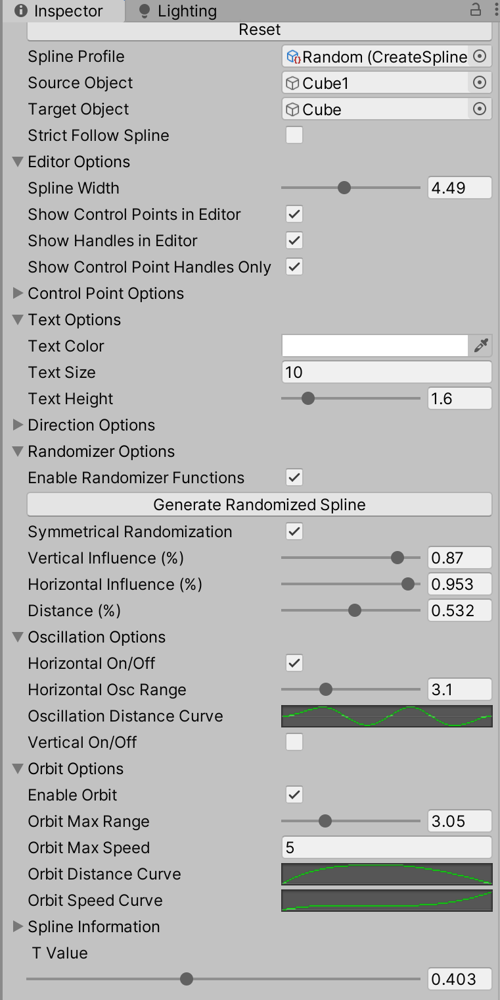

# Spline Tools

A novel system for crating animations and pathing using Splines/bezier curves in the Unity 3D engine

## [Inspiration](https://www.youtube.com/watch?v=rXLH0nkgkbc)

## Attempts to address the following issues

- difficulty prototyping complex ability interraction chains

- getting meaningful logging data

- tools to implement essential principles of animation in the movement of non-ambulatory actors

- the ability to randomly seed/generate abilities and animations to kick-start the creative process

```md
Included is an excerpt from a custom spline system I designed and prototyped for a unrealeased MOBA title.
Special thanks to @FreyaHolmer's 2015 Unite presentation on the subject for being a fantastic primer.
```



