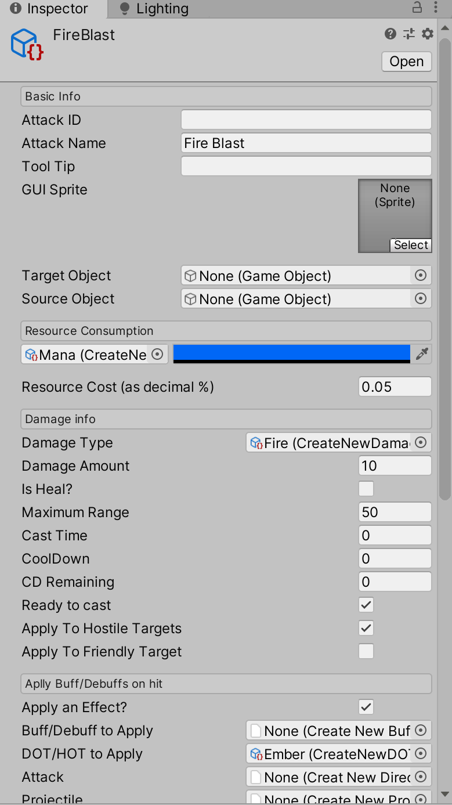

# Spline Tools

A novel system for crating animations and pathing using Splines/bezier curves in the Unity 3D engine. Originally developed to compliment the FOE MMO/MOBA combat systems. A version of the complete project is available [here](https://github.com/deserializeme/Game-Projects/tree/main/combat_system)

## [Inspiration](https://www.youtube.com/watch?v=rXLH0nkgkbc)
Warning: depicts some anime violence - skip to 1:30 to bypass.

## Attempts to address the following issues

- difficulty prototyping complex ability interraction chains

- getting meaningful logging data

- tools to implement essential principles of animation in the movement of non-ambulatory actors

- the ability to randomly seed/generate abilities and animations to kick-start the creative process

```md
Included is an excerpt from a custom spline system I designed and prototyped for a unrealeased MOBA title.
Special thanks to @FreyaHolmer's 2015 Unite presentation on the subject for being a fantastic primer.
```
<a href="https://gfycat.com/HollowMajesticArmadillo-size_restricted.gif">     </a>
<a href="custom_editors/editorviewsplineeditor.PNG">                          </a>
<a href="https://gfycat.com/ThoroughSeriousIchidna-size_restricted.gif">      </a>
<a href="https://gfycat.com/FemaleFaithfulBorderterrier-size_restricted.gif"> </a>

## Editors and gizmos:





